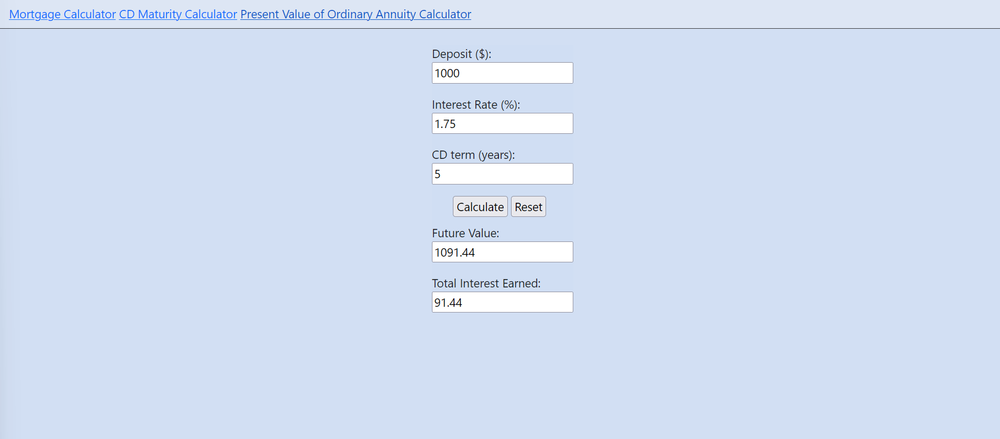

# Workbook 2 Workshop: Financial Calculators

Utilized CSS and JavaScript to construct a website with three calculators: Mortgage, CD Maturity, & Present Value of Ordinary Annuity. You can reset the inputs with the 'Reset' button, as well as navigate to each page through a navigation bar. 

### Mortgage Calculator

### CD Maturity Calculator

### Present Value of Ordinary Annuity Calculator

#### An Interesting Bit of Code

Using a reset button to reset all input fields was a bit of a challenge but a satisfying result when it was completed.
